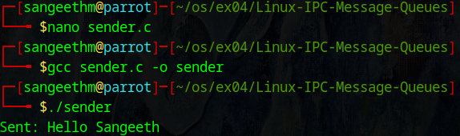
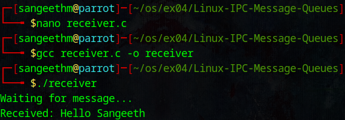

# Linux-IPC-Message-Queues
Linux IPC-Message Queues

# AIM:
To write a C program that receives a message from message queue and display them

# DESIGN STEPS:

### Step 1:

Navigate to any Linux environment installed on the system or installed inside a virtual environment like virtual box/vmware or online linux JSLinux (https://bellard.org/jslinux/vm.html?url=alpine-x86.cfg&mem=192) or docker.

### Step 2:

Write the C Program using Linux message queues API 

### Step 3:

Execute the C Program for the desired output. 

# PROGRAM:

## C program that receives a message from message queue and display them
nano receiver.c
```
 #include <stdio.h>
 #include <sys/ipc.h>
 #include <sys/msg.h>

struct message {
    long type;
    char text[100];
};

int main() {
    key_t key = ftok(".", 'a');
    int msgid = msgget(key, 0666 | IPC_CREAT);
    struct message msg;
    
    printf("Waiting for message...\n");
    msgrcv(msgid, &msg, sizeof(msg.text), 1, 0);
    printf("Received: %s\n", msg.text);
    
    return 0;
}
```
nano sender.c
```
 #include <stdio.h>
 #include <sys/ipc.h>
 #include <sys/msg.h>
 #include <string.h>

struct message {
    long type;
    char text[100];
};

int main() {
    key_t key = ftok(".", 'a');
    int msgid = msgget(key, 0666 | IPC_CREAT);
    struct message msg;
    
    msg.type = 1;
    strcpy(msg.text, "Hello Thaarakeshwar");
    
    msgsnd(msgid, &msg, sizeof(msg.text), 0);
    printf("Sent: %s\n", msg.text);
    
    return 0;
}
```
gcc receiver.c -o receiver

./receiver

gcc sender.c -o sender

./sender

## OUTPUT :





# RESULT:
The programs are executed successfully.
